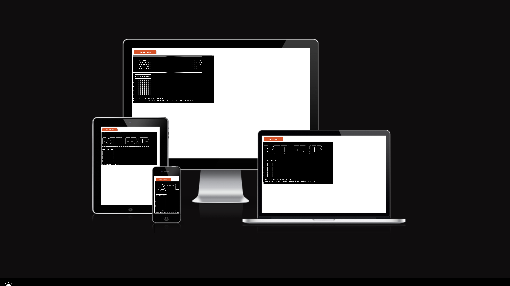
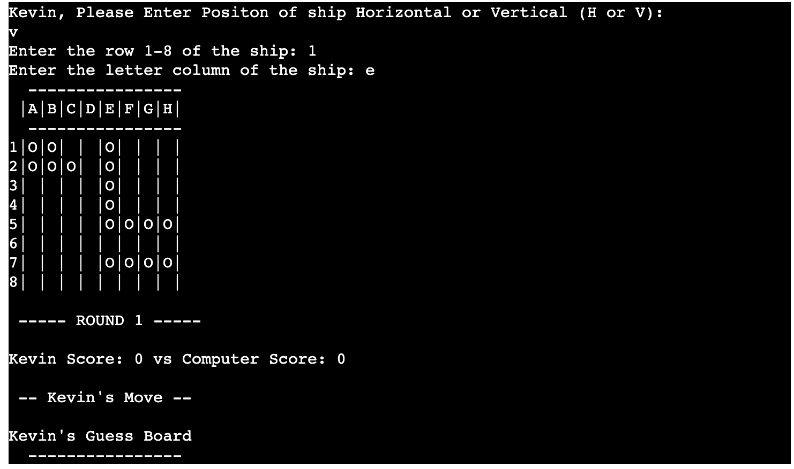

#  Battleship Warzone Game
Battleship Warzone is a Python terminal game, which runs in the Code Institute mock terminal on Heroku.

The User has to try and beat the Computer by finding and destroying all 5 of the Computer's boats before the Computer destroys their ships. The boats take up different sizes ranging from 2 to 4

[Click Here, To see a live version of my project.](https://battleship-kf.herokuapp.com/)

## How To Play
-----
Battleship Warzone is based on the board game Battleship. You can learn more check here on [Wikipedia](https://en.wikipedia.org/wiki/Battleship_(game)). In this version, the player competes against the computer. The user is first invited to place their ships on the board. The player has the opportunity to place each boat either horizontally or verticle. Then the player is asked on what row and column they would like to place the ship. This process is repeated for each of the 5 ships.

After each ship is placed on the board. The board is displayed with the updated position of the ship the user has just added. The ships are represented as a collection of "O". The Player is asked to make their move to try and find the computer's ships by ebtering the row and column they would like to select. the ships on the Computer board are hidden from the Player until they hit a ship by correctly guessing the position of a ship. 

When a player hits a ship this is represented by "X". A miss is represented by "-". The Player and Computer take turns to make guesses to try and find and sink each other's ships.
The winner is the player who sinks all of their opponent's battleships first.
## Features
-----
### Existing Features
* Random board generation:
    * The computer's ships are randomly placed on the board.
    * The Player can not see where the Computer's ships are.

* Accepts input from the Player
* allows the player to input a name.

* Allows the player to position ships on board.

* Play against Computer
* Ships are different sizes.
* Keep track of the scores of both Player and the Computer.

* Input validation and error-handling
    * player cannot enter coordinates outside the size of the board
    * For the row user must enter numbers.
    * For the column user must enter a letter.
    * User/computer cannot select the same coordinates twice.

### Future Features
* Add a message to display when the player hit a ship
* Improve graphics for the user interface
* add an option for multiplayer

## Screenshots of GamePlay
#### Display during the game Player's board

#### Display of computers board during a game

#### Feedback to the user on a Miss

#### feedback to the user on Hit

#### End of game message

## Data Model
-----
 I decided to declare globally four Boards, Two for the player and two for the Computer, each having a board that stores the location of their ships(e.g USER_BOARD and PC_BOARD) and another board to stores their moves made (e.g USER_MOVE_BOARD and PC_MOVE_BOARD)

 The Board has a fixed size i.e 8 x 8, and the number of ships i.e 5.

 The program has many functions to enable the game to run, such as game() that when called displays the Battleship logo, and Player board and calls other functions to enable the player to populate the board.

## Testing
-----
I have manually tested this project by :
* passed the code through the PEP8 Code Institute validator - no major errors were detected
    * A few minor errors.
* Passing invalid values such as strings when numbers are expected, numbers when a string is expected.
* Positioning the ships out of the parameters of the board.
* Placing two ships in the same location.
* Testing it in my local terminal and the Code Institute Heroku terminal.

### Validator Testing
* [PEP8 Code Institute validator:] (https://pep8ci.herokuapp.com/#)
    * A few minor errors:
        * 10 - for an invalid sequence for the Battleship logo (e.g invalid escape sequence )
        * 11 - Line too long error

### Bugs
#### Solved Bugs
* The Player could enter the same coordinates multiple times and the program would accept this as a turn for the player. I added an if else statement to check to see if the place on the board was equal to "-" or "X". if so the player is asked to take their go again

#### Remaining Bugs
* As of the latest version of this project no known bugs have been found.

## Deployment
-----
The Project was deployed using Code Institute's mock terminal for Heroku.
* Steps to be taken for deployment:
    * Fork or clone this repository
    * Then click on <mark>Create new app</mark> button
    
    * Choose a unique name for the app and your region
    * Click <mark>Create app</mark> button
    * On the ribbon tab go to <mark>Settings</mark> tab
    
    * Scroll down to <mark>Config Vars</mark> -> click on <mark>Reveal Config Vars</mark> button
    * Set key to <mark>PORT</mark> and value to <mark>8000</mark>
    * Then scroll down to <mark>Buildpacks</mark> -> click on <mark>Add buildpack</mark>
    * Select <mark>Python</mark> and <mark>Node.js</mark> (in this order)!!
    
    * Go to <mark>Deploy</mark> section 
    * Scroll down to <mark>Deployment Method</mark> section -> Choose your preferred deployment method
    * Then search for repository from the <mark>Connect to</mark> section and then click connect 
    * Choose either Enable Automatic Deploys is on or off
    * Choose the branch to deploy in the Manual deploy section 
    * Then click <mark>Deploy</mark> Button
    

## Credits
-----
* Code Institute for the deployment terminal and template.
* Wikipedia for details of the Battleships game
* geeksforgeeks - for research purposes
